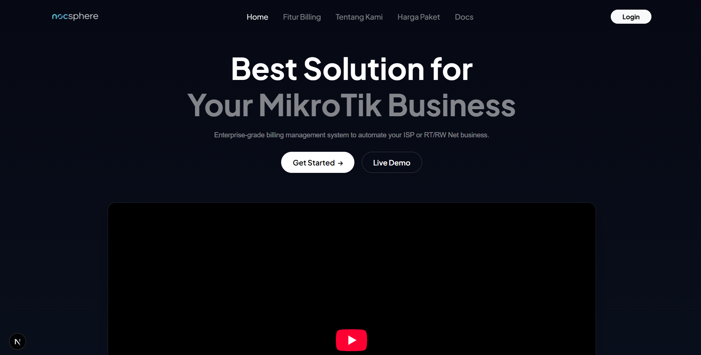

# Nocsphere

Nocsphere adalah sistem billing dan manajemen pengguna berbasis web yang dirancang untuk mengotomatisasi serta menyederhanakan pengelolaan layanan jaringan seperti Hotspot dan PPPoE pada perangkat MikroTik RouterOS.

Sistem ini ditujukan untuk penyedia jasa internet (ISP), jaringan komunitas (RT/RW Net), dan manajemen infrastruktur perusahaan yang membutuhkan integrasi terpusat untuk manajemen akun, pembuatan voucher, pemantauan masa aktif, serta isolasi pelanggan secara real-time.


---

## Status Proyek

* **Status Pengembangan:** Ongoing / Aktif Dikembangkan
* **Fase:** Alpha Development

*Catatan: Repositori ini sedang dalam tahap pengembangan intensif. Arsitektur kode, skema basis data, dan API dapat berubah sewaktu-waktu tanpa pemberitahuan sebelumnya.*

---

## Arsitektur & Fitur Utama

### 1. Manajemen Layanan MikroTik
* **Provisi Otomatis:** Pembuatan, pembaruan, dan penghapusan akun Hotspot serta PPPoE langsung ke RouterOS via API.
* **Isolasi Pelanggan:** Pemutus koneksi atau pengalihan otomatis (*automated isolation*) bagi pelanggan PPPoE yang telah melewati masa aktif.

### 2. Billing & Sinkronisasi
* **Manajemen Paket & Voucher:** Kontrol penuh terhadap profil kecepatan (bandwith limitation), masa berlaku, dan harga paket.
* **Billing Mesin Waktu:** Pelacakan masa aktif secara real-time untuk meminimalkan kebocoran layanan.

### 3. Kontrol Multi-Router
* Dukungan pengelolaan multi-perangkat (*multi-router support*) dari satu dasbor terpusat.

---

## Spesifikasi Teknologi

* **Backend Framework:** Python / FastAPI
* **Database Engine:** MySQL / MariaDB
* **Protokol Komunikasi:** RouterOS API / RouterOS API over SSL
* **Frontend Stack:** Next.js, HTML5, CSS3, JavaScript (Boostrap)

---

## Kebutuhan Sistem

Sebelum melakukan instalasi, pastikan lingkungan server telah memenuhi spesifikasi berikut:
* Python 3.8 atau versi yang lebih baru
* MySQL Server 8.0+ atau MariaDB 10.5+
* Perangkat MikroTik dengan RouterOS v6.x / v7.x
* Layanan API MikroTik aktif (Port default: 8728 atau 8729 untuk SSL)

---

## Prosedur Instalasi

### 1. Klon Repositori
```bash
git clone https://github.com/vynts/nocsphere.git
cd nocsphere
```
